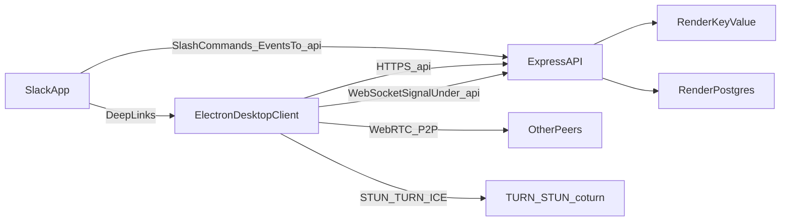

# Tandem Clone v1 Architecture Plan

## Goals

- Recreate the Tandem feel for a small engineering team with the fewest moving parts.
- Prioritize **cross-talk audio**, **video calls**, and **screen sharing** as essential v1 features via **WebRTC mesh (P2P)**.
- Support **Electron desktop app only** for v1 (no browser client).
- Add deep Slack integration: slash commands, app deep links, and native Slack call/join entry points where available.
- Enforce **TDD** and **checkpoint confirmations** so each milestone is validated before continuing.

## Minimal Technical Stack

- **Desktop client:** Electron + React + TypeScript + Tailwind CSS
- **App server:** Node.js + Express + WebSocket (or Socket.IO) for signaling and Slack endpoints
- **Media transport:** WebRTC mesh with mandatory audio, camera video, and display media (screen share) tracks
- **NAT traversal:** STUN + TURN via `coturn` (self-host TURN on Render for reliability)
- **Data store:** Render Postgres for team/workspace/user metadata and call records
- **Ephemeral state:** Render Key Value (Redis-compatible) for short-lived presence/room state
- **Auth:** Slack OAuth as primary sign-in (team-scoped), JWT session cookies
- **Slack integration service:** Slack app (OAuth, slash commands, event endpoints, deep links, call provider integration hooks)

## Why This Is “Simple but Reliable”

- Mesh P2P avoids SFU complexity and infra costs for small call sizes.
- A focused Express service handles signaling and Slack integration only.
- TURN is the only extra infra component and is required for real-world network compatibility.
- A single desktop codebase avoids browser support overhead and keeps v1 focused.
- Slack integration is additive and can be rolled out in small layers.
- Every backend endpoint is namespaced under `/api` (for example, `/api/health`, `/api/slack/events`, `/api/signal`).

## Agent Execution Protocol

- Work one todo at a time; do not overlap milestones.
- For each todo, execute in this order:
  1. Write/update tests first (red).
  2. Implement minimum code to pass tests (green).
  3. Refactor while keeping tests green.
  4. Run full relevant test suite and lint for changed files.
  5. Pause and present evidence of pass/fail, then wait for user confirmation before next todo.
- If any test fails, do not proceed to the next todo.
- If scope ambiguity appears, stop and request clarification before coding.

## Architecture Flow

## Render Deployment Shape

- **Web Service 1:** `api` (Express exposing `/api/`* endpoints + signaling)
- **Private Service:** `turn` (`coturn`)
- **Managed services:** Render Postgres + Render Key Value
- Use Render private networking between `api` and `turn`; expose only what clients need publicly.
- Leverage Render autoscaling and managed Postgres/Key Value to keep ops low ([Render](https://render.com/)).
- Route contract:
  - Backend REST/webhook routes: `/api/`*
  - Signaling socket endpoint: `/api/signal`
  - No web UI routes in v1

## Slack Integration Scope (v1)

- Slack app with:
  - `/tandem` slash command: create/join room
  - Channel shortcut: “Start Tandem call”
  - Message action: “Join in Tandem”
- Deep links:
  - Slack -> desktop protocol link (`tandem://room/:roomId`)
  - If desktop app is not installed, redirect to installer/download page
- Native Slack call/join buttons:
  - Implement Slack call provider integration path where workspace/app permissions allow
  - Keep deep-link fallback always available for reliability

## P2P Mesh Constraints to Accept Up Front

- Recommended cap: ~2-6 participants per active room for stable quality.
- Above that, CPU and upstream bandwidth grow quickly per participant.
- Keep quality predictable by defaulting to camera on/off per user setting and allowing only one active screen-share publisher per room.

## Suggested Build Order

1. Electron shell and Tandem-like presence layout.
2. WebRTC mesh rooms with audio + video baseline via Express-hosted signaling under `/api/signal`.
3. Add screen sharing controls and presenter handoff.
4. Add TURN and ICE failover hardening.
5. Add Slack OAuth + slash commands + deep links.
6. Add Slack native call/join integration hooks and polish desktop linking.

## TDD Test Plan By Todo

### 1) Scaffold Monorepo

- Tests to write first:
  - `GET /api/health` returns 200 and JSON status.
  - Unknown `/api/`* route returns JSON 404 shape.
  - Electron deep-link handler parses `tandem://room/:roomId` into room navigation state.
- Done when:
  - Base test runner and lint run in CI/local.
  - API route namespace and Electron deep-link contract are enforced by tests.
- Pause gate:
  - Share test output and wait for approval.
- Command-level verification:
  - `npm run test --workspace api`
  - `npm run test --workspace desktop`
  - `npm run lint --workspace api && npm run lint --workspace desktop`
  - Evidence to share: pass counts, skipped tests, and zero lint errors.

### 2) WebRTC Mesh (Audio + Video + Screen Share)

- Tests to write first:
  - Signaling contract tests for room join/leave, offer/answer, ICE relay.
  - Presence lifecycle tests (connect, heartbeat, disconnect).
  - Client state tests for room membership and peer state transitions.
  - Media negotiation tests for camera video add/remove and track replacement.
  - Screen-share tests for start/stop flow and presenter handoff lock.
- Done when:
  - Two users can join and complete audio + video negotiation via `/api/signal`.
  - One user can start/stop screen sharing and all peers see state changes correctly.
  - Disconnect cleanup does not leave stale room state.
- Pause gate:
  - Demo checklist + test evidence; wait for approval.
- Command-level verification:
  - `npm run test --workspace api -- signal`
  - `npm run test --workspace desktop -- webrtc`
  - `npm run test:e2e --workspace desktop -- room-audio`
  - `npm run test:e2e --workspace desktop -- room-video`
  - `npm run test:e2e --workspace desktop -- room-screen-share`
  - Evidence to share: join/leave logs, video negotiation pass, and screen-share start/stop pass summary.

### 3) TURN + Hardening

- Tests to write first:
  - ICE config endpoint/contract tests (returns STUN+TURN config).
  - Connection fallback test scenario definition (direct ICE fail -> relay success).
  - Retry/backoff tests for transient signaling disconnects.
- Done when:
  - Relay path is verifiably usable for restrictive networks.
  - Failure modes return actionable UI/API errors.
- Pause gate:
  - Share fallback verification results; wait for approval.
- Command-level verification:
  - `npm run test --workspace api -- ice`
  - `npm run test --workspace desktop -- reconnect`
  - `npm run test:e2e --workspace desktop -- turn-fallback`
  - Evidence to share: at least one TURN-relayed success and reconnect behavior logs.

### 4) Slack Integration v1

- Tests to write first:
  - Slack request signature verification tests.
  - Slash command handler contract tests (create/join room response shape).
  - Deep-link generation tests (desktop protocol).
- Done when:
  - `/api/slack/`* endpoints are verified and stable.
  - Slack-triggered join flow lands users in correct room.
- Pause gate:
  - Show command flow evidence and test run; wait for approval.
- Command-level verification:
  - `npm run test --workspace slack-app`
  - `npm run test --workspace api -- slack`
  - `npm run test:e2e --workspace slack-app -- slash-command-join`
  - Evidence to share: signature verification pass, slash response sample, and deep-link output.

### 5) Render Deploy + Smoke

- Tests to write first:
  - Production config validation tests (required env vars present).
  - Post-deploy smoke tests for `/api/health`, Slack endpoint reachability, and signaling connect.
- Done when:
  - Render environment is reproducible from config.
  - Core user journeys pass in deployed environment.
- Pause gate:
  - Share smoke test results and deployment status; wait for approval.
- Command-level verification:
  - `npm run test --workspace api -- config`
  - `npm run smoke:render --workspace api`
  - `npm run smoke:desktop --workspace desktop`
  - Evidence to share: deployed API checks, WebSocket connect success, Slack endpoint verification.

## Spec Clarifications For Agent-Built Delivery

- **API namespace rule:** all server endpoints must be under `/api/`*.
- **Room identity:** use stable `roomId` and `workspaceId` in every signaling payload to avoid cross-workspace leakage.
- **Presence TTL:** define heartbeat interval and expiration window explicitly to prevent zombie online states.
- **Call size cap:** enforce soft cap of 6 participants for mesh rooms with clear UI warning at limit.
- **Essential media features:** audio, video, and screen sharing are required for v1 acceptance.
- **Screen-share policy:** one active sharer at a time per room; explicit handoff or stop before next share starts.
- **Error schema:** standardize API errors as `{ code, message, retryable }` for deterministic client behavior.
- **Desktop deep-link policy:** canonical join URL is `tandem://room/:roomId`.
- **Slack fallback policy:** if native Slack call provider step is unavailable, always return desktop deep-link join path.
- **Electron security baseline:** `contextIsolation: true`, `nodeIntegration: false`, and preload bridge only.
- **Media defaults:** camera off by default, mic behavior explicit and user-visible.
- **Definition of done:** each todo requires passing tests, lint, and explicit user approval before next todo.

## Key Project Paths To Create/Use

- `[/Users/jrod/Documents/personal/tandim/api](/Users/jrod/Documents/personal/tandim/api)`
- `[/Users/jrod/Documents/personal/tandim/infra/render.yaml](/Users/jrod/Documents/personal/tandim/infra/render.yaml)`
- `[/Users/jrod/Documents/personal/tandim/desktop](/Users/jrod/Documents/personal/tandim/desktop)`
- `[/Users/jrod/Documents/personal/tandim/slack-app](/Users/jrod/Documents/personal/tandim/slack-app)`

## Success Criteria for v1

- Engineers can see online/presence state and join room audio in one click.
- Engineers can start/join video calls and toggle camera reliably.
- Engineers can start/stop screen sharing with predictable room-wide updates.
- Calls connect reliably across restrictive networks (TURN fallback).
- Slack users can trigger and join calls with minimal friction.
- Full call experience works in the Electron desktop app without requiring a browser client.

